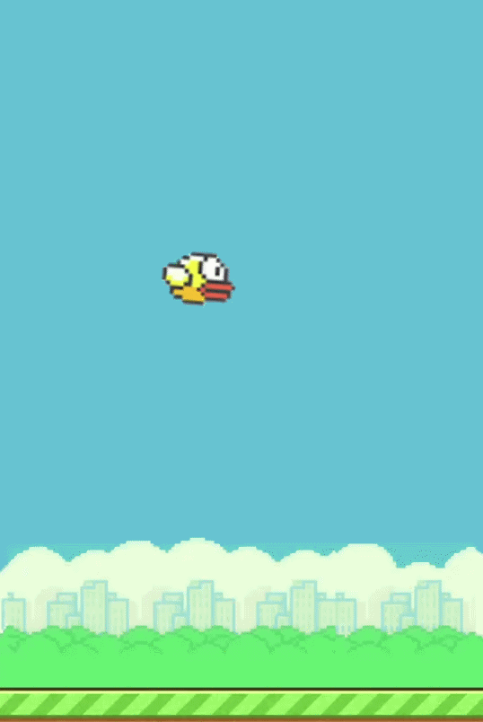

# 🐦 Flappy Bird JS

A classic Flappy Bird game built with pure HTML5 Canvas, CSS3, and JavaScript.



## 🎮 How to Play

* **Click / Tap / Press Any Key:** Jump/Flap wings
* Avoid the pipes and try to get the highest score possible!

## 🛠️ Built With

* **HTML5 Canvas:** For rendering game elements
* **JavaScript (Vanilla):** Game physics, collision detection, and logic
* **CSS3:** Page layout and styling

## 🚀 Live Demo

[Play Live Here](https://onlineplayground.netlify.app/) *(Open on PC for the best experience)*

## 📂 Project Setup

Simply clone the repository and open `index.html` in your browser:

```bash
git clone [https://github.com/shami-islam-khan/flappy-bird-js.git](https://github.com/shami-islam-khan/flappy-bird-js.git)